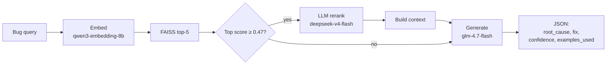
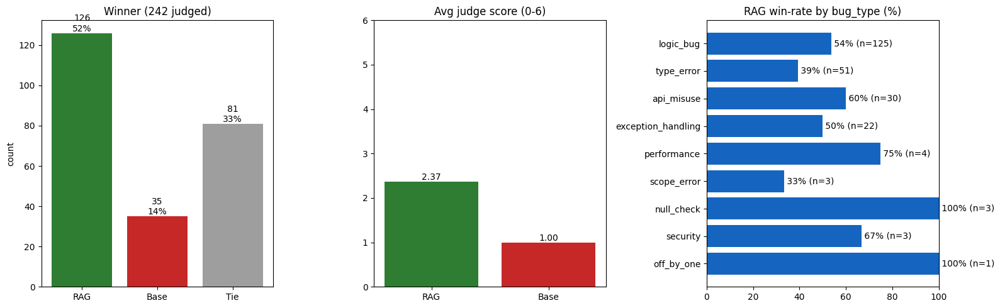
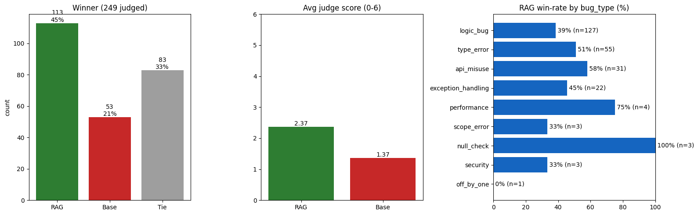
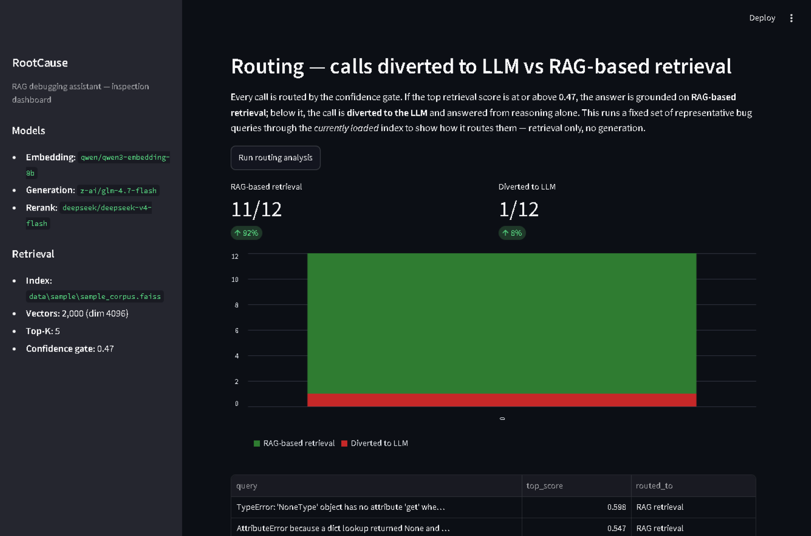

# RootCause

RootCause is a retrieval-augmented debugging assistant that ships as an **MCP tool**. Give
it a bug report, traceback, or code snippet and it retrieves similar historical bug-fixes
from a FAISS vector index, gates on retrieval confidence, optionally reranks the matches
with an LLM, and returns a grounded JSON answer — root cause, concrete fix, confidence, and
the examples it used. It runs **out of the box** against a bundled ~2,000-example sample
corpus (trained on over 10,000 scraped GitHub PR samples); point it at your own corpus by setting two environment variables.

## Architecture



All retrieval/rerank/generation logic lives in [`src/core.py`](src/core.py). The MCP server
([`src/rootcause_server.py`](src/rootcause_server.py)) and the Streamlit dashboard
([`src/dashboard.py`](src/dashboard.py)) are thin callers of that one module, so there is a
single source of truth for the pipeline.

| Component | Model | Notes |
|---|---|---|
| Embedding | `qwen/qwen3-embedding-8b` | Must match the model the index was built with (dim 4096) |
| Reranking | `deepseek/deepseek-v4-flash` | Reorders top-5 candidates; reasoning effort `low` |
| Generation | `z-ai/glm-4.7-flash` | Grounded JSON answer; reasoning disabled |
| Confidence gate | `0.47` | Calibrated empirically — see [CALIBRATION.md](CALIBRATION.md) |

## Quickstart (PowerShell)

```powershell
git clone https://github.com/x4ddy/RootCause.git
cd RootCause

python -m venv .venv
.\.venv\Scripts\Activate.ps1
pip install -r requirements.txt

# Configure your OpenRouter key
Copy-Item .env.example .env
# then edit .env and set OPENROUTER_API_KEY=sk-or-v1-...

# Run the MCP server against the bundled sample data — no data prep needed
python src\rootcause_server.py
```

macOS / Linux: `python3 -m venv .venv && source .venv/bin/activate`, then `cp .env.example .env`.

The server speaks MCP over stdio, so it's meant to be launched by an MCP client (see
[MCP registration](#mcp-registration)) rather than opened in a browser. The bundled sample
index (`data/sample/`) is committed, so retrieval works immediately — you only need the
`OPENROUTER_API_KEY` for the live embedding/generation calls.

## Bring your own data

The sample index is built from `data/sample/sample_bug_corpus.jsonl` by
[`scripts/build_index.py`](scripts/build_index.py). To rebuild it, or to build an index
from your own corpus:

```powershell
# Rebuild the bundled sample from its JSONL (~2,000 embedding calls, no LLM parsing)
python scripts\build_index.py --input data\sample\sample_bug_corpus.jsonl --output data\sample\sample_corpus.faiss

# Build from your own corpus and point the server/dashboard at it
python scripts\build_index.py --input my_bugs.jsonl --output data\my_corpus.faiss
$env:FAISS_INDEX_PATH="data\my_corpus.faiss"
$env:METADATA_PATH="data\my_corpus_metadata.pkl"
```

`build_index.py` auto-detects each input row: rows that are **already labeled** (have
`bug_type` + `issue` + `fix`) are normalized directly with no LLM call; rows that are **raw
diffs** (title + patches, no labels) are parsed by an LLM into the structured schema. Pass
multiple files to `--input` to mix sources, and `--max-samples N` to cap rows per file for
a cheap dry run when a file needs parsing.

`core.py` reads `FAISS_INDEX_PATH` / `METADATA_PATH` from the environment, defaulting to
the bundled sample — so pointing at a full corpus is two env vars, no code edits. After
changing the embedding model or corpus, re-run
[`scripts/calibrate_threshold.py`](scripts/calibrate_threshold.py) to re-pick the
confidence gate (see [CALIBRATION.md](CALIBRATION.md)).

## MCP registration

Register the stdio server with any MCP-compatible client. Adjust the path to wherever you
cloned the repo:

```json
{
  "mcpServers": {
    "rootcause": {
      "command": "python",
      "args": ["C:\\path\\to\\RootCause\\src\\rootcause_server.py"],
      "env": {
        "OPENROUTER_API_KEY": "sk-or-v1-your-key-here"
      }
    }
  }
}
```

The server exposes one tool:

```
analyze_bug(query: str) -> str   # returns JSON: {root_cause, fix, confidence, examples_used}
```

## Dashboard

A Streamlit dashboard is included as a demo/inspection tool on top of the same pipeline
(it is **not** a replacement for the MCP server, which stays the primary integration
point):

```powershell
streamlit run src\dashboard.py
```

It shows, in one page: the configured models and the loaded index (path + vector count +
confidence gate) in the sidebar; a text box + **Analyze** button that runs the full
embed → retrieve → gate → rerank → generate path and renders the JSON answer plus the raw
retrieved candidates and their scores in a table; and an **Evaluation** section with the
two charts below.

## Evaluation

**Setup.** Answers were generated with `z-ai/glm-4.7-flash` and judged by
`deepseek/deepseek-v4-pro` (LLM-as-judge: head-to-head winner vs an LLM-only baseline, plus
a 0–6 quality score) on ~240 held-out bugs. The ablation is the confidence gate itself —
**on** (the shipped config: divert weak-retrieval queries to the LLM) vs **off** (pure RAG:
always ground on retrieval).

**Confidence gating ON — shipped config.** 242 judged: **RAG 52% / tie 33% / baseline 14%**;
average judge score **2.37 vs 1.00**.



**Confidence gating OFF — pure RAG.** 249 judged: RAG 45% / tie 33% / baseline 21%; average
judge score 2.37 vs **1.37**.



**Takeaway.** Turning the gate on diverts the weak-retrieval queries to the LLM instead of
grounding on bad context: the baseline's win share drops **21% → 14%** and RAG's rises
**45% → 52%**, while RAG's own average score holds at 2.37. The gate earns its keep by
routing calls, not by retrieving harder.

**Routing on the bundled index.** Where do calls actually go? Against the bundled
2,000-example index, a representative set of 12 bug queries routes as **11/12 (92%)
RAG-based retrieval, 1/12 (8%) diverted to the LLM** (the one diverted, "loop skips the last
element", scores 0.434 — just below the 0.47 gate). Reproduce it live in the dashboard's
**Routing** section.



See [CALIBRATION.md](CALIBRATION.md) for how the `0.47` gate threshold was chosen.

## Repo map

```
RootCause/
  README.md
  LICENSE
  CALIBRATION.md
  .gitignore
  .env.example
  requirements.txt
  src/
    core.py               # shared retrieval + rerank + generation logic
    rootcause_server.py   # MCP server — thin wrapper over core.py
    dashboard.py          # Streamlit inspection dashboard
  scripts/
    build_index.py        # JSONL corpus -> FAISS index (+ optional LLM parsing)
    calibrate_threshold.py# empirical confidence-gate calibration
  data/
    sample/
      sample_bug_corpus.jsonl     # ~2,000 rows, stratified across bug_type
      sample_corpus.faiss         # bundled sample index (committed)
      sample_corpus_metadata.pkl
  images/
    gate-on.png           # eval: confidence gating on (shipped)
    gate-off.png          # eval: confidence gating off (pure RAG)
    routing-chart.png     # calls diverted to LLM vs RAG-based retrieval (dashboard)
  tests/
    test_smoke.py         # index/metadata alignment + one live retrieve() call
```

## Tests

```powershell
pytest tests\
```

The alignment check runs with no API key or network. The retrieval check makes a single
live embedding call and is skipped automatically when `OPENROUTER_API_KEY` is unset.

## License

MIT — see [LICENSE](LICENSE). © 2026 Saksham Katna.
